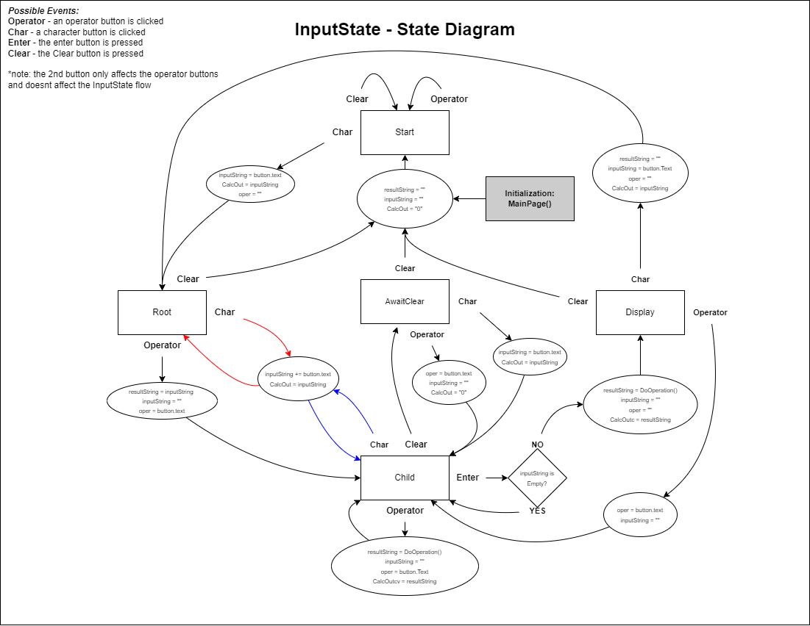

%%html

# MAUI Calculator - LAB 3 #
## ECET 230 ##
## by Aaron Huinink ##

My first MAUI .NET application with a GUI.
The control flow is managed by this state diagram, which can be found at /assets/images/calculator_states.png

